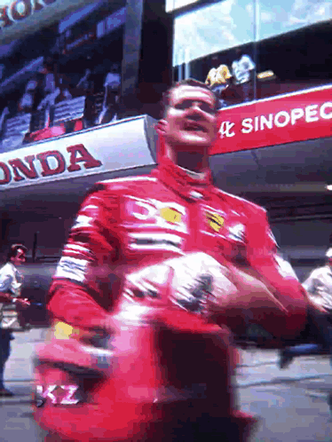

<div align="center">
  

  # ⚡ hello, I'm anomalic1

  

  
  
  <a href="https://pezzai.com"></a>
  
</div>

---

### 🧬 `whoami`

```bash
anomalic1@mac ~ % cat operator.json
```

```json
{
  "handle":  "anomalic1",
  "status":  "building at 3AM",
  "focus":   ["machine learning", "robotics", "physics simulations", "3D worlds"],
  "shipped": ["PezzAI.com ✅", "sentry.sec — scaling"],
  "infra":   "24/7 home server · APIs + bot hosting",
  "rig":     "macOS · dark mode · minimalist",
  "next":    "B.Tech → Robotics & AI",
  "ping":    "discord → anomalic1"
}
```

---

### ⚡ the arsenal

**⌨️ languages**

<div>
  
  
  
  
  
  
  
</div>

**🌐 web**

<div>
  
  
  
  
  
</div>

**🤖 ai · 3d · simulation**

<div>
  
  
  
  
  
</div>

**🛠️ systems · ops**

<div>
  
  
  
  
  
  
  
  
  
</div>

---

### 🚀 ship log

<div align="center">

**🔥 FLAGSHIP · [mega-tts](https://github.com/anomalic1/mega-tts)**

<a href="https://github.com/anomalic1/mega-tts">
  
</a>

<br>

<a href="https://github.com/anomalic1/autotube-pipeline">
  
</a>
<a href="https://github.com/anomalic1/yt-metadata-automator">
  
</a>

<br>

<a href="https://github.com/anomalic1/askinglucidly">
  
</a>
<a href="https://github.com/anomalic1/langdeckbuild">
  
</a>

<br>

<a href="https://github.com/anomalic1/whatsapad">
  
</a>

<br>

**[📂 full archive →](https://github.com/anomalic1?tab=repositories)**

</div>

---

### 📊 telemetry

<div align="center">
  
  
  <br><br>
  
</div>

---

### 🐍 the snake
<!-- powered by .github/workflows/snake.yml — run the workflow once to activate -->

<div align="center">
  <picture>
    <source media="(prefers-color-scheme: dark)" srcset="https://raw.githubusercontent.com/anomalic1/anomalic1/output/github-snake-dark.svg" />
    <source media="(prefers-color-scheme: light)" srcset="https://raw.githubusercontent.com/anomalic1/anomalic1/output/github-snake.svg" />
    
  </picture>
</div>

---

### 📈 contribution radiation

<div align="center">
  
</div>

---

### 🏆 trophy room

<div align="center">
  
  <br><br>
  
  <br><br>
  
</div>

---

### 📡 open a channel

<div align="center">
  <a href="https://github.com/anomalic1"></a>
  <a href="https://pezzai.com"></a>
  <!-- replace YOUR_DISCORD_ID with your real user ID (Discord → Settings → Advanced → Developer Mode → Copy ID) -->
  <a href="https://discord.com/users/YOUR_DISCORD_ID"></a>
</div>

---

<div align="center">
  
  <br><br>
  <samp>ship it at 3AM · debug it at 9 · repeat</samp>
</div>
